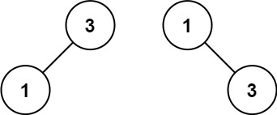

# Convert Sorted Array to Binary Search Tree

Given an integer array `nums` where the elements are sorted in **ascending order**, convert _it to a **height-balanced** binary search tree_.

##### Example 1:

> **Input**: nums = [-10,-3,0,5,9]
>
> **Output**: [0,-3,9,-10,null,5]
>
> **Explanation**: [0,-10,5,null,-3,null,9] is also accepted:
> 

##### Example 2:

> **Input**: nums = [1,3]
>
> **Output**: [3,1]
>
> **Explanation**: [1,null,3] and [3,1] are both height-balanced BSTs.

##### Constraints:

- `1 <= nums.length <= 104`
- `-104 <= nums[i] <= 104`
- `nums` is sorted in a **strictly increasing** order.
