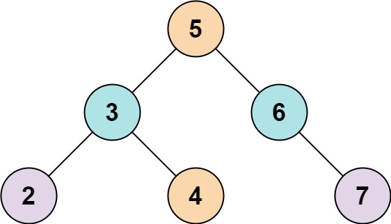

# Two Sum 4 - input is a BST

Given the `root` of a binary search tree and an integer `k`, return `true` _if there exist two elements in the BST such that their sum is equal to `k`, or `false` otherwise_.

##### Example 1:

> **Input**: root = [5,3,6,2,4,null,7], k = 9
> **Output**: true

##### Example 2:

> **Input**: root = [5,3,6,2,4,null,7], k = 28
> **Output**: false

##### Constraints:

- The number of nodes in the tree is in the range `[1, 104]`.
- `-104 <= Node.val <= 104`
- `root` is guaranteed to be a valid binary search tree.
- `-105 <= k <= 105`
